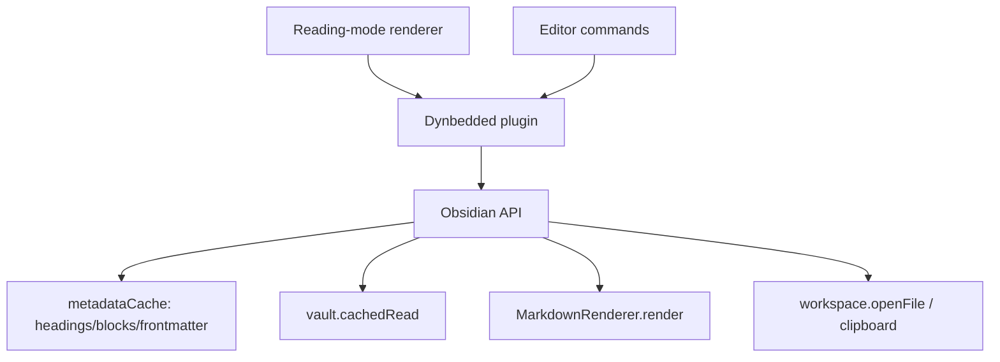
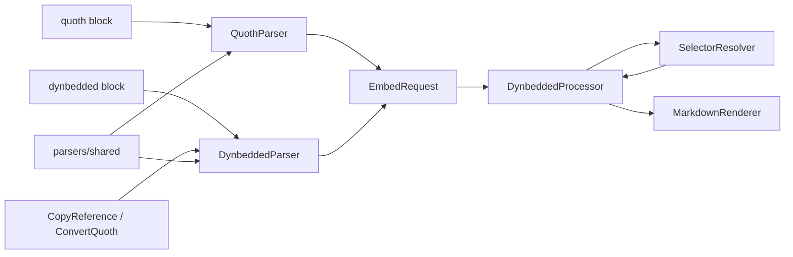
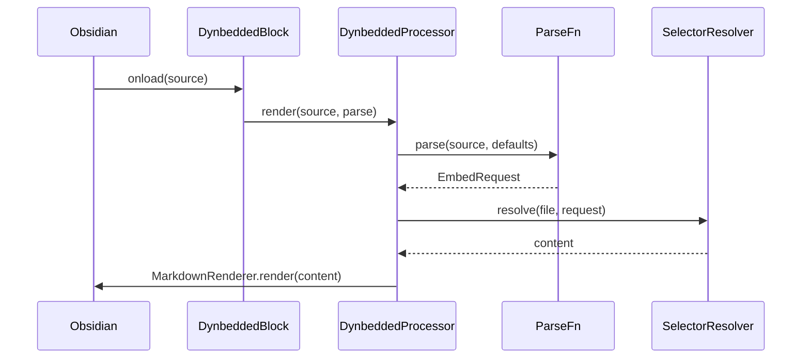

# Solution Design Document

> Reverse-documented from the shipped implementation (v1.5.0, PR #32). Architecture decisions
> are recorded as **CONFIRMED** because they were made and merged during implementation.
> Sections that do not apply to a single-process Obsidian plugin (databases, network APIs,
> multi-component deployment) are marked *Not applicable*.

## Validation Checklist

### CRITICAL GATES (Must Pass)

- [x] All required sections are complete
- [x] No [NEEDS CLARIFICATION] markers remain
- [x] Architecture pattern is clearly stated with rationale
- [x] All architecture decisions confirmed (made + merged at implementation)
- [x] Every interface has specification

### QUALITY CHECKS (Should Pass)

- [x] Context sources listed with relevance ratings
- [x] Project commands discovered from `package.json`
- [x] Constraints → Strategy → Design → Implementation path is logical
- [x] Every component in the diagram has a directory mapping
- [x] Error handling covers all error types
- [x] Quality requirements are specific and measurable
- [x] Component names consistent across diagrams
- [x] A developer could implement from this design

---

## Constraints

- **CON-1** TypeScript 5 (type-check only), esbuild bundle to CJS / target ES2018; the Obsidian plugin API is the only runtime framework.
- **CON-2** **Never change existing behaviour** — every new capability is opt-in, default off; existing whole-file and `#header` embeds must render byte-identical.
- **CON-3** Only one plugin may register a given code-block language — Dynbedded can render `quoth` blocks only once Quoth is uninstalled.
- **CON-4** Community-plugin review rules: sentence-case UI text; CSS limited to the `minAppVersion` Chromium floor (stylelint/browserslist `chrome 114`); no inline styles.
- **CON-5** Single maintainer — the Quoth-compat surface must be isolated and removable without touching the core.

## Implementation Context

### Required Context Sources

#### Documentation Context
```yaml
- doc: docs/XDD/specs/001-quoth-replacement/requirements.md
  relevance: HIGH
  why: "The PRD this design satisfies"
- url: https://github.com/erykwalder/quoth/blob/main/README.md
  relevance: HIGH
  why: "Quoth field/grammar ground truth for fidelity (path/ranges/join/display/show)"
```

#### Code Context
```yaml
- file: src/DynbeddedProcessor.ts
  relevance: HIGH
  why: "The render orchestrator that was refactored from a single string-parsing pass"
- file: src/DynbeddedBlock.ts
  relevance: MEDIUM
  why: "MarkdownRenderChild lifecycle; one block = one EmbedRequest; auto-refresh"
- file: src/main.ts
  relevance: HIGH
  why: "Code-block registration (dynbedded + guarded quoth) and commands"
- file: "@package.json"
  relevance: MEDIUM
  why: "Build/lint scripts and the browserslist Chromium floor"
```

### Implementation Boundaries
- **Must Preserve:** existing `whole` and `#header` embed output (byte-identical); the `DynbeddedBlock` auto-refresh lifecycle; date substitution (`getDynamicDate`).
- **Can Modify:** `DynbeddedProcessor.render()` internals (split into parser + resolver); settings tab; `styles.css`.
- **Must Not Touch:** the release pipeline; existing setting semantics (only add new opt-in settings).

### External Interfaces

#### System Context Diagram


#### Interface Specifications
The only external interface is the Obsidian plugin API (in-process). No network, database, auth, or message-queue interfaces. Relevant API surface:

```yaml
inbound:
  - name: "Code-block processor (dynbedded)"
    api: registerMarkdownCodeBlockProcessor("dynbedded", ...)
    data_flow: "Block source + el + ctx → rendered embed"
  - name: "Code-block processor (quoth, opt-in)"
    api: registerMarkdownCodeBlockProcessor("quoth", ...)  # guarded, behind renderQuothBlocks
    data_flow: "Quoth block source → rendered embed"
  - name: "Editor commands"
    api: addCommand({ editorCallback })   # Copy reference, Convert quoth blocks
outbound:
  - name: "Obsidian metadata + vault"
    api: metadataCache.getFirstLinkpathDest / getFileCache, vault.cachedRead, resolveSubpath
    data_flow: "Resolve link target, headings/blocks, file content"
  - name: "Rendering + workspace"
    api: MarkdownRenderer.render, workspace.getLeaf().openFile, navigator.clipboard
data: Not applicable (no persistence beyond plugin settings via loadData/saveData)
```

### Project Commands
```bash
Install: npm install
Dev:     npm run dev          # esbuild watch → test vault
Test:    (no unit suite; logic verified via ad-hoc esbuild bundle assertions)
Lint:    npm run lint         # eslint src/ + stylelint styles.css
Build:   npm run build        # tsc -noEmit + esbuild production
Deploy:  npm run build:dev    # one-shot build into Dynbedded/.obsidian/plugins/
```

## Solution Strategy

- **Architecture Pattern:** a small **pipeline with a syntax-agnostic core model**. Two front-end *parsers* (dynbedded native, quoth compat) produce one `EmbedRequest`; a single *resolver* turns its `Selector` into content; the *processor* orchestrates parse → date-resolve → file-resolve → extract → render.
- **Integration Approach:** the historical single-pass `DynbeddedProcessor.render()` is split so its link/header/date logic lives in the parser and its slicing logic in the resolver. `main.ts` registers a second, guarded `quoth` processor behind an opt-in flag.
- **Justification:** one shared model makes Quoth compatibility a thin adapter rather than a divergent second code path, and keeps every selector/feature usable by both syntaxes. It also lets the existing behaviour be preserved exactly (the `whole`/`subpath` selectors reproduce the old slicing).
- **Key Decisions:** see ADRs.

## Building Block View

### Components


### Directory Map
**Component**: obsidian-dynbedded (`src/`)
```
src/
├── EmbedRequest.ts            # NEW: model — EmbedRequest, Selector, Anchor, ParseFn, ParserDefaults, DynbeddedError
├── parsers/
│   ├── DynbeddedParser.ts     # NEW: native syntax → EmbedRequest + serializeDynbedded (inverse)
│   ├── QuothParser.ts         # NEW: quoth syntax → EmbedRequest (isolated, deletable)
│   └── shared.ts              # NEW: splitTopLevel / parseShow (used by both parsers)
├── SelectorResolver.ts        # NEW: Selector + TFile → content slice
├── DynbeddedProcessor.ts      # MODIFY: render() refactored into an orchestrator
├── DynbeddedBlock.ts          # MODIFY: carries a ParseFn (dynbedded | quoth)
├── DynbeddedSettingTab.ts     # MODIFY: new opt-in settings + DisplayMode type
├── main.ts                    # MODIFY: guarded quoth registration + commands
└── commands/
    ├── CopyReference.ts        # NEW: selection/cursor → EmbedRequest
    └── ConvertQuoth.ts         # NEW: rewrite quoth blocks → dynbedded in a note's text
```

### Interface Specifications

#### Application Data Models
```typescript
interface EmbedRequest {
  fileName: string;                       // link target; {{date}} resolved by the orchestrator
  selector: Selector;
  display: 'embedded' | 'inline';         // 'embedded' === block (Quoth vocabulary)
  attribution: ('author' | 'title')[];    // show: footer; empty = none
  headerHierarchy: boolean;               // existing #2 flag, heading selectors only
  includeHeading: boolean;                // render the heading line in a #section embed
  join: string;                           // multi-range separator; default " ... "
}

type Selector =
  | { kind: 'whole' }
  | { kind: 'subpath'; subpath: string }          // #Heading | #^block
  | { kind: 'after'; anchor: Anchor }             // anchor (exclusive) → EOF
  | { kind: 'between'; from: Anchor; to: Anchor } // inclusive both ends
  | { kind: 'multi'; parts: Selector[] };         // joined by EmbedRequest.join

type Anchor =
  | { kind: 'text'; text: string }                // matches a line by raw text (incl. '#')
  | { kind: 'pos'; line: number; col: number };   // line:col (column line-granular at present)

type ParseFn = (source: string, defaults: ParserDefaults) => EmbedRequest;
interface ParserDefaults { display: DisplayMode; includeHeading: boolean; }
```

No database schema, no internal HTTP API, no external API integration (*Not applicable* — in-process plugin).

### Implementation Examples

#### Example: `after` text-anchor resolution (range engine)
**Why this example:** it defines the core fidelity behaviour (anchor matches a raw line; range runs to EOF, deliberately unlike a `#header` section).
```typescript
// SelectorResolver — text anchor → 0-based line index, then to end of file
const idx = findAnchorLine(lines, anchor, request); // exact trimmed-line match, else substring
return lines.slice(idx + 1).join('\n');             // exclusive of the anchor, through EOF
```

#### Example: guarded quoth registration
**Why this example:** the registration must degrade gracefully when Quoth still owns the language.
```typescript
if (this.settings.renderQuothBlocks) {
  try {
    this.registerMarkdownCodeBlockProcessor("quoth", (src, el, ctx) =>
      ctx.addChild(new DynbeddedBlock(el, src, this.app, this, ctx, parseQuoth)));
  } catch (e) {
    new Notice("Dynbedded: could not render quoth blocks — is Quoth still installed?");
  }
}
```

## Runtime View

### Primary Flow: render an embed
1. Obsidian invokes the registered code-block processor → `DynbeddedBlock.onload()`.
2. Processor calls the block's `ParseFn(source, defaults)` → `EmbedRequest`.
3. Date tokens (`{{…}}`) resolved in `fileName` and every anchor.
4. File resolved via `metadataCache.getFirstLinkpathDest`.
5. `SelectorResolver.resolve(file, request)` → content string.
6. Render: block via `MarkdownRenderer.render` into a div, or inline (unwrap single `<p>`); optional attribution footer; optional quote-style / source-link.



### Error Handling
- Parse / resolve problems throw `DynbeddedError`; the processor routes the message through `showError`, which is **silent-mode aware** (renders an empty block when Silent mode is on).
- Header found but empty → render nothing (existing behaviour).
- `quoth` registration conflict → `Notice`, no crash.
- Non-`DynbeddedError` exceptions are re-thrown (genuine bugs, not user errors).

## Deployment View

### Single Application Deployment
- **Environment:** Obsidian (Electron) desktop; in-process plugin.
- **Configuration:** plugin settings persisted via `loadData`/`saveData`; all new settings default off.
- **Dependencies:** none beyond the Obsidian API.
- **Performance:** content read via `vault.cachedRead`; one `EmbedRequest` per block; auto-refresh interval unchanged.
- **Build artifacts:** `build/main.js`, `manifest.json`, `styles.css` (committed by semantic-release).

Multi-component coordination: *Not applicable*.

## Cross-Cutting Concepts

### System-Wide Patterns
- **Error handling:** `DynbeddedError` for recoverable/user errors + silent-mode-aware display; re-throw for real bugs.
- **Settings as defaults, blocks as overrides:** `ParserDefaults` carries `display` + `includeHeading`; a block key (`display:`, `includeHeading:`) overrides the setting (mirrors how `defaultDisplay` already worked).
- **Isolation of compat code:** `QuothParser` imports only the model + `parsers/shared`; nothing core imports it except the guarded registration, so it can be deleted wholesale.
- **CSS:** all visual options are opt-in classes (`dynbedded-quote-style`, `dynbedded-source-link`, `dynbedded-inline`, `dynbedded-attribution`); accent uses `var(--interactive-accent)`; no inline styles (browserslist gate).

### User Interface & UX
- New settings live under the existing **Embedding** heading and a new **Quoth compatibility** section; UI text is sentence case.
- Source-link icon: `setIcon(..., "link")`, keyboard-accessible, positioned to clear Obsidian's code-block `<>` button.

## Architecture Decisions

- [x] **ADR-1 Syntax-agnostic `EmbedRequest` model**: introduce one internal model that both parsers produce and the resolver consumes.
  - Rationale: makes Quoth compat a thin adapter, not a second code path; lets all selectors work for both syntaxes; enables byte-identical preservation of existing selectors.
  - Trade-offs: an upfront behaviour-preserving refactor before any feature.
  - User confirmed: **CONFIRMED** (merged in Phase 0).

- [x] **ADR-2 Silent compatibility behind an opt-in flag**: render `quoth` blocks via a second guarded registration; do not force a rewrite.
  - Rationale: zero-rewrite cutover for ~2255 notes; respects never-change-existing-behaviour.
  - Trade-offs: a permanent second syntax to maintain; requires Quoth uninstalled (one owner per language).
  - User confirmed: **CONFIRMED**.

- [x] **ADR-3 `after` runs to end of file**: text-anchored `after` embeds to EOF, distinct from `#header` which stops at the next heading.
  - Rationale: matches Quoth's offset semantics and the real daily-note workflow.
  - Trade-offs: two similar-looking selectors with different boundaries — documented.
  - User confirmed: **CONFIRMED**.

- [x] **ADR-4 Per-block overrides via `ParserDefaults`**: settings set defaults; block keys override (`display`, `includeHeading`).
  - Rationale: consistent, ergonomic control; avoids global-only behaviour.
  - Trade-offs: parser signature carries a defaults object.
  - User confirmed: **CONFIRMED**.

- [x] **ADR-5 Drop vault-wide bulk migration (#30 reduced)**: keep only a per-note convert command.
  - Rationale: under the silent strategy, bulk conversion is unnecessary and risky across 2255 files.
  - Trade-offs: notes stay in `quoth` syntax (rendered by Dynbedded) rather than becoming native.
  - User confirmed: **CONFIRMED**.

## Quality Requirements
- **Reliability:** existing whole-file and `#header` embeds render byte-identical (regression baseline = test-vault notes).
- **Correctness:** `npm run build` + `npm run lint` green; pure parse/serialize/convert logic covered by assertions (23/23 at ship).
- **Fidelity:** the daily-note workflow (`after "# Heading"` + inline) matches Quoth in side-by-side comparison.
- **Performance:** no extra file reads beyond `cachedRead`; no change to auto-refresh cost.

## Acceptance Criteria (EARS)

**Main flow (PRD Feature 1–3):**
- [x] WHERE *Render quoth blocks* is enabled and Quoth is uninstalled, THE SYSTEM SHALL render `quoth` blocks with the same content Quoth produced.
- [x] WHEN a block sets `after: "X"`, THE SYSTEM SHALL embed from the anchor line (exclusive) to end of file.
- [x] WHEN a block sets `display: inline` on single-paragraph content, THE SYSTEM SHALL unwrap the paragraph so it flows inline.
- [x] THE SYSTEM SHALL render existing whole-file and `#header` embeds byte-identically.

**Error handling:**
- [x] IF the `quoth` language is already owned (Quoth installed), THEN THE SYSTEM SHALL show a notice and not crash.
- [x] IF parsing or resolution fails, THEN THE SYSTEM SHALL show an error (or nothing in Silent mode), not throw to the console as an unhandled error.

**Edge cases:**
- [x] WHILE *Default display mode* is `inline`, THE SYSTEM SHALL apply it to blocks that omit `display:`.
- [x] WHERE a block sets `includeHeading: true|false`, THE SYSTEM SHALL override the setting default for that block.

## Risks and Technical Debt

### Known Technical Issues
- `#-list-item` subpaths are unsupported (fall through to "header not found").
- `line:col` positions are resolved per line; the column is ignored.
- Inline display of multi-block content falls back to block layout.

### Technical Debt
- A pre-existing latent bug is preserved verbatim for byte-identical behaviour: the date-format validity check `window.moment(...).isValid` references the function (always truthy) rather than calling it — intentionally not "fixed" here to avoid changing behaviour.
- No automated test suite; logic is verified by an ad-hoc esbuild bundle + node assertions.

### Implementation Gotchas
- Code-block language registration throws if already owned → must be guarded.
- Heading-section slicing relies on an appended trailing newline so `slice(start, -1)` drops only the blank line.
- `DisplayMode`/`ParserDefaults` imports in parsers are **type-only** so the parsers carry no runtime dependency on `DynbeddedSettingTab` (enables isolated testing).

## Glossary

### Domain Terms
| Term | Definition | Context |
|------|------------|---------|
| Embed | Inlining another note's content into the current note | Core plugin function |
| Silent strategy | Render `quoth` blocks directly instead of rewriting them | Chosen cutover approach |

### Technical Terms
| Term | Definition | Context |
|------|------------|---------|
| `EmbedRequest` | Syntax-agnostic model of one embed | Produced by parsers, consumed by resolver |
| `Selector` | What slice of a file to embed | whole / subpath / after / between / multi |
| `ParseFn` | `(source, defaults) → EmbedRequest` | Lets one processor render either syntax |
| Anchor | A line reference: raw text or `line:col` | Range selectors |
